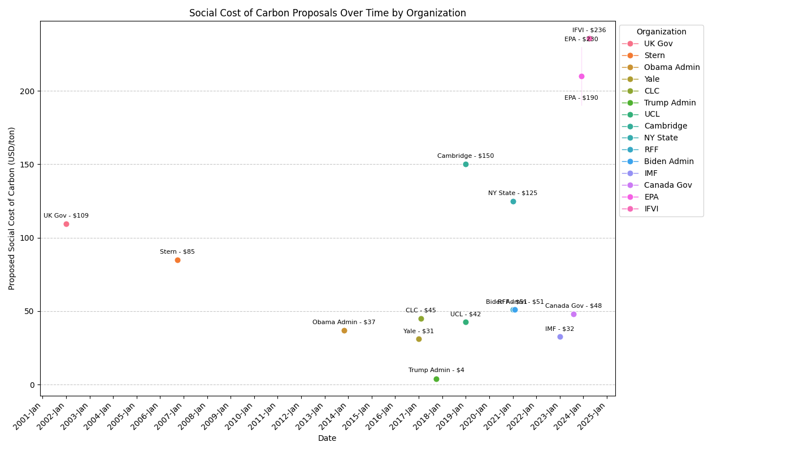
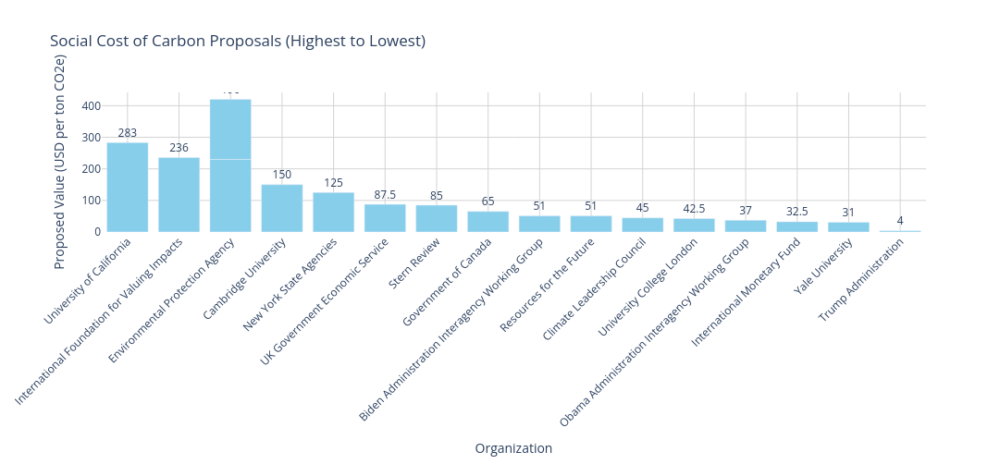
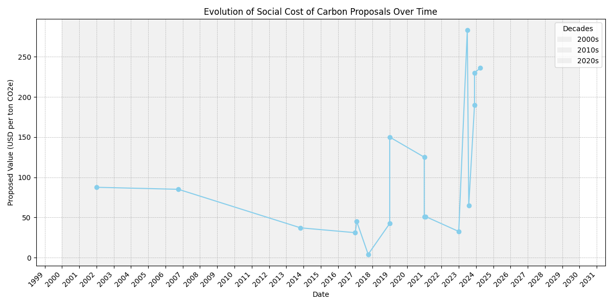

#  Monetised GHG Emissions Calculator

This repository supports a Streamlit interface which will be made available through Hugging Face Spaces to provide a simple interface for converting from companies' greenhouse gas emissions disclosures, released in quantitative terms, and for converting those into their monetized rates according to various social cost of carbon proposals .

This is a second version of an earlier calculator I put together. The reason that this is a new repository is because I accidentally overwrote the data in the first calculator, and since then I've decided to take a slightly different direction with this calculator by including a few additional social cost of carbon (SCC) numbers. Rather than attempt to salvage my first calculator, I figured that it was easier to start this project from scratch bundling together a few changes.  

## Disclaimer

I was drawn to this work as a result of my employment. Nevertheless, at least in its first iterations, my work with data in the realm of environmental and sustainability topics should not be perceived as anything other than my own first entry notes and attempts at exploring various questions. High among them is the question of whether and how companies' far-reaching environmental impacts could be monetized and integrated into financial accounting - an idea, at least in some implementations, called impact accounting. I open source technical projects as a matter of course and I haven't thought it is important to distinguish between my initial work in this and other areas. 

## Limitations of Calculations (Summary)

Simulating the monetization of greenhouse gas emissions is limited by the difficulties of working with two different yardsticks: the social cost of carbon, which only considers carbon dioxide emissions, and the quantitative reporting data from companies for greenhouse gas emissions (GHG), which almost always includes gases beyond carbon dioxide. 

 It' has been suggested that organisations should propose a social cost of greenhouse gas emissions encompassing both carbon dioxide and other greenhouse gases with higher  global warming potential (GWP) values But doing so would be challenging given the relative paucity of such estimates. 

 The practical effect of monetizing greenhouse gas emissions at proposed rates, which only consider carbon dioxide in some cases, **is that the monetizations will actually be understatements of the true estimated monetary cost of the emissions**. Therefore, the calculations will actually be conservative and understatements of the true cost of these emissions. . 

## Proposals Included In Dataset

When working with data for analysis one generally tries to always compare like with like. 

In the case of aggregating different policy proposals for the social cost of carbon, however, this is extremely difficult. 

But aggregating them together in some corpus *is* useful to the extent that one may wish to compare the monetized emissions against these different proposals. 

This can be a revealing analysis because it can demonstrate tangibly how even small differences in the proposed social cost of carbon can have outsized effects once they are applied to quantity metrics that are often rather vast in nature. 

Consider, for example, the case of the oil and gas industry, which reports its GHG emissions in millions of tons of carbon dioxide equivalents by convention. In scope three, where the values often eclipse scopes 1 and two by a multiple, small differences in the value factor here can result in dramatic changes in the computed social cost of carbon, which, if compared against financial accounts, could 'cause huge differences In the calculated values for financials after monetized emissions

It's for this reason that this calculator is made available as a tool for analysis, calculation and policy ideation. That is to say, with an understanding that the comparisons are imperfect. But with the belief and hope that even imperfect comparisons can be useful in this context. As our struggles in the realm of climate change make abundantly clear, bringing good policy forward is a matter of urgency. 

## Proposals - Charts

## Proposals - Group 1
 

| Proposal Name                               | Date (Month, Year) | Proposed Value ($/ton CO2e) | Average Value ($/ton CO2e) | Decisive | Country          | ISO 3 | ISO 2 | HDI Category      | Details                                                                 |
|---------------------------------------------|---------------------|-----------------------------|----------------------------|----------|------------------|-------|-------|-------------------|-------------------------------------------------------------------------|
| International Foundation for Valuing Impacts | April 2024         | $236                        | $236                      | Yes      | United States    | USA   | US    | Very High       | Proposed a standardized approach for companies to report GHG emissions monetarily. |
| EPA (Final Report)                          | December 2023      | $120-$340                  | $216                      | No       | United States    | USA   | US    | Very High       | Updated SCC values using advanced methodologies and lower discount rates. |
| U.S. EPA (Updated Proposal)                 | December 2023      | $190                        | $190                      | Yes      | United States    | USA   | US    | Very High       | Finalized updated SCC values, reflecting significant increases based on best science. |
| University of California, Davis             | July 2023          | $283                        | $283                      | Yes      | United States    | USA   | US    | Very High       | Equity-weighted SCC emphasizing climate damages and uncertainty. |
| IMF                                         | January 2023       | $15-$50                    | $32.5                     | No       | United States    | USA   | US    | Very High       | Proposed international carbon price floor based on income levels of countries.       |
| New York State Agencies                     | January 2021       | $125                        | $125                      | Yes      | United States    | USA   | US    | Very High       | Guidance under Climate Leadership Act to reduce emissions and achieve net-zero.      |
| Biden Administration (IWG Interim Update)  | February 2021      | $51                         | $51                       | Yes      | United States    | USA   | US    | Very High       | Interim update reinstating Obama-era methodology with adjustments.     |
| Trump Administration                        | October 2017       | $3-$5                      | $4                        | No       | United States    | USA   | US    | Very High       | Lowered SCC estimates focusing on domestic impacts with higher discount rates.       |
| Climate Leadership Council                  | February 2017      | $40-$50                    | $45                       | No       | United States    | USA   | US    | Very High       | Carbon dividends plan starting at $40/ton, increasing annually by 5% above inflation.|
| Obama Administration (IWG Update)          | November 2013      | $37                         | $37                      | Yes      | United States    | USA   | US    | Very High       | Updated SCC values for regulatory impact analyses under federal guidelines.          |
| UK Government Economic Service              | 2002               | £35-£140                   | £112.8                 | No       | United Kingdom   | GBR   | GB    | Very High      | Recommended illustrative SCC range for policy appraisal across government sectors.   |
| Stern Review                                | October 2006       | ~$85                       | ~$85                      | Yes      | United Kingdom   | GBR   | GB    | Very High       | Early influential report advocating for strong climate action.                       |
| Canada Government                             | August 2023       | CAD$65                      | ~$48                      | Yes     | Canada             | CAN   | CA    | Very High       | The Federal Carbon Price was increased to CAD$65 per tonne CO2e in 2023. |
| French Government - Quinet Report           | 2019               | €250-€770                  | ~$420 ($270-$820)         | No       | France             | FRA   | FR    | Very High       | Recommended range for the SCC with a central value around 250 Euros per tonne CO2e by 2030, rising steeply after that. |

## Author

Daniel Rosehill  
(public at danielrosehill dot com)

## Licensing

This repository is licensed under CC-BY-4.0 (Attribution 4.0 International) 
[License](https://creativecommons.org/licenses/by/4.0/)

### Summary of the License
The Creative Commons Attribution 4.0 International (CC BY 4.0) license allows others to:
- **Share**: Copy and redistribute the material in any medium or format.
- **Adapt**: Remix, transform, and build upon the material for any purpose, even commercially.

The licensor cannot revoke these freedoms as long as you follow the license terms.

#### License Terms
- **Attribution**: You must give appropriate credit, provide a link to the license, and indicate if changes were made. You may do so in any reasonable manner, but not in any way that suggests the licensor endorses you or your use.
- **No additional restrictions**: You may not apply legal terms or technological measures that legally restrict others from doing anything the license permits.

For the full legal code, please visit the [Creative Commons website](https://creativecommons.org/licenses/by/4.0/legalcode).